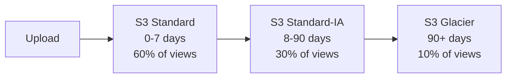

# 🎯 Practice Questions - Test 4 Incorrect Areas Only

**Generated from**: Practice Test 4 Performance Analysis  
**Score**: 49/65 (75.38%)  
**Focus Areas**: 16 incorrect questions across all domains

---

## 📊 Question Distribution by Domain

- **Cost Optimization**: 8 questions (60% weak area)
- **Resilient Architecture**: 10 questions
- **High-Performing Architecture**: 10 questions  
- **Secure Architectures**: 6 questions

**Total**: 34 targeted practice questions

---

## Domain 1: Design Cost-Optimized Architectures

### Question 1: CloudWatch Agent for Memory Metrics

An application team wants to configure Auto Scaling to add EC2 instances when memory utilization exceeds 80%. The solutions architect attempts to create a target tracking policy but cannot find a memory utilization metric in the predefined metrics list.

What step is required before creating the Auto Scaling policy?

**A.** Enable detailed monitoring on the Auto Scaling group  
**B.** Install the CloudWatch agent on instances and publish custom memory metrics  
**C.** Create a CloudWatch alarm based on CPU utilization as a proxy  
**D.** Request AWS Support to enable memory metrics for the account

<details>
<summary>✅ Answer</summary>

**Correct Answer: B**

**Explanation:**
- EC2 does not publish memory metrics by default
- CloudWatch agent must be installed to collect and publish memory data
- After publishing custom metric, create target tracking policy on it
- Detailed monitoring only increases frequency of default metrics (CPU, network)

**Implementation:**
```bash
# Install CloudWatch agent
sudo yum install amazon-cloudwatch-agent

# Configure agent to publish memory
/opt/aws/amazon-cloudwatch-agent/bin/amazon-cloudwatch-agent-config-wizard

# Metric appears as: CWAgent > Memory > mem_used_percent
```

**References:**
- [CloudWatch Agent Configuration](https://docs.aws.amazon.com/AmazonCloudWatch/latest/monitoring/Install-CloudWatch-Agent.html)
- [Auto Scaling Custom Metrics](https://docs.aws.amazon.com/autoscaling/ec2/userguide/as-scaling-target-tracking.html#as-scaling-target-tracking-custom-metric)
</details>

---

### Question 2: Redshift Manual Snapshot Cleanup

A data analytics company uses Amazon Redshift with automated snapshots (7-day retention). Over the past year, the team has created 50+ manual snapshots during major migrations and releases. The CFO notices snapshot storage costs have tripled. What is the MOST cost-effective first action?

**A.** Reduce automated snapshot retention to 1 day to free up space  
**B.** Identify and delete manual snapshots that are no longer required  
**C.** Enable Redshift snapshot compression to reduce storage  
**D.** Archive old snapshots to S3 Glacier Deep Archive

<details>
<summary>✅ Answer</summary>

**Correct Answer: B**

**Explanation:**

**Cost Breakdown:**
- **Automated snapshots**: Expire automatically after 7 days
- **Manual snapshots**: Persist indefinitely (ongoing cost)
- Manual snapshots likely account for majority of storage costs

**Action Plan:**
1. List all manual snapshots: `aws redshift describe-cluster-snapshots --snapshot-type manual`
2. Review with stakeholders (DBA, compliance team)
3. Delete snapshots older than retention policy
4. Document deletion for audit trail

**Why Not Others:**
- **A:** Reduces backup window (increases data loss risk)
- **C:** No such feature exists (snapshots already compressed)
- **D:** Redshift snapshots stay in Redshift/S3 (no Glacier option)

**Cost Impact:**
```
Before: 50 manual snapshots × $0.024/GB/month × 1TB = $1,200/month
After: 5 retained snapshots × $0.024/GB/month × 1TB = $120/month
Savings: 90%
```

**References:**
- [Redshift Snapshots](https://docs.aws.amazon.com/redshift/latest/mgmt/working-with-snapshots.html)
</details>

---

### Question 3: S3 Glacier Retrieval Tier Selection

A healthcare company archives patient records to S3 Glacier Flexible Retrieval for compliance. Records must be retrievable within 5 hours for audit requests. The operations team currently uses Expedited retrieval (1-5 minutes) for all requests to ensure fast access. How can they reduce retrieval costs while meeting the requirement?

**A.** Switch to Standard retrieval (3-5 hours)  
**B.** Use Bulk retrieval with parallel requests  
**C.** Reduce the frequency of audit requests  
**D.** Move to S3 Glacier Instant Retrieval

<details>
<summary>✅ Answer</summary>

**Correct Answer: A**

**Retrieval Tier Comparison:**

| Tier | Retrieval Time | Cost/GB | Cost/1000 Requests | Use Case |
|------|---------------|---------|-------------------|----------|
| **Expedited** | 1-5 minutes | $0.03 | $10.00 | Emergency access |
| **Standard** | 3-5 hours | $0.01 | $0.05 | Planned retrieval |
| **Bulk** | 5-12 hours | $0.0025 | $0.025 | Large batch jobs |

**Why Standard Fits:**
- ✅ Requirement: "within 5 hours"
- ✅ Standard delivers in 3-5 hours (meets requirement)
- ✅ 66% cheaper than Expedited
- ✅ Consistent SLA for planned retrieval

**Cost Savings Example:**
```
Monthly retrievals: 100 GB
Expedited: 100 × $0.03 + $10 = $13.00
Standard: 100 × $0.01 + $0.05 = $1.05
Savings: $11.95/100GB (92% reduction)
```

**Why Not Others:**
- **B:** Bulk can take up to 12 hours (violates 5-hour requirement)
- **C:** Doesn't address root cause (overpaying for retrieval tier)
- **D:** Instant Retrieval for millisecond access (overkill and expensive)

**References:**
- [S3 Glacier Retrieval Options](https://docs.aws.amazon.com/AmazonS3/latest/userguide/restoring-objects-retrieval-options.html)
</details>

---

### Question 4: Savings Plans Strategy for Mixed Workloads

A company runs three workload types on AWS:
- **Web tier**: t3, m5, c5 instances across us-east-1 and eu-west-1
- **App tier**: c5 instances only in us-east-1 (stable for 2+ years)
- **Database**: RDS MySQL Multi-AZ in us-east-1

The CFO wants to minimize costs with AWS commitment discounts. What is the MOST cost-effective combination?

**A.** Compute Savings Plans for all workloads  
**B.** EC2 Instance Savings Plans for all workloads  
**C.** Compute Savings Plans (web) + EC2 Instance Savings Plans (app) + RDS Reserved Instances (database)  
**D.** EC2 Instance Savings Plans for EC2 workloads + Compute Savings Plans for RDS

<details>
<summary>✅ Answer</summary>

**Correct Answer: C**

**Savings Strategy Matrix:**

| Workload | Pattern | Best Option | Discount | Lock-in |
|----------|---------|-------------|----------|---------|
| **Web** | Diverse families, multi-region | Compute SP | 66% | Flexible |
| **App** | Single family (c5), single region | EC2 Instance SP | 72% | Specific |
| **RDS** | Managed database | RDS Reserved Instance | 69% | RDS-specific |

**Why This Mix:**

**1. Compute Savings Plans (Web Tier):**
- ✅ Applies across instance families (t3, m5, c5)
- ✅ Portable across regions (us-east-1 and eu-west-1)
- ✅ Flexibility for evolving architecture
- Commitment: $/hour compute usage

**2. EC2 Instance Savings Plans (App Tier):**
- ✅ Highest discount (72%)
- ✅ Stable workload justifies lock-in
- ✅ c5 family commitment acceptable
- Commitment: Specific to c5 family in us-east-1

**3. RDS Reserved Instances (Database):**
- ✅ Separate pricing model from EC2
- ✅ **Critical**: RDS NOT covered by EC2/Compute Savings Plans
- ✅ Database-specific discounts
- Commitment: Instance class + engine

**Cost Example:**
```
Monthly On-Demand Cost: $10,000

With Strategy C:
Web (Compute SP): $3,000 → $1,020 (66% off)
App (EC2 Instance SP): $5,000 → $1,400 (72% off)
RDS (Reserved): $2,000 → $620 (69% off)
Total: $3,040 (70% savings)

With Wrong Strategy D (EC2 SP for RDS):
RDS remains On-Demand: $2,000 (no discount)
Total: $4,420 (only 56% savings)
```

**Common Mistake:** Assuming Savings Plans cover RDS (they don't!)

**References:**
- [Savings Plans Types](https://docs.aws.amazon.com/savingsplans/latest/userguide/what-is-savings-plans.html)
- [RDS Reserved Instances](https://aws.amazon.com/rds/pricing/)
</details>

---

### Question 5: Auto Scaling Mixed Instance Policy

An e-commerce platform runs on Auto Scaling (minimum 3, maximum 20 instances). Traffic is unpredictable with sudden spikes during flash sales. The CTO wants to optimize costs while maintaining reliability. Current setup: 100% On-Demand instances.

What is the MOST cost-effective Auto Scaling configuration?

**A.** 100% Spot instances to maximize savings  
**B.** On-Demand base = 3, above that 80% Spot / 20% On-Demand  
**C.** On-Demand base = 0, mixed 50% Spot / 50% On-Demand  
**D.** On-Demand base = 10, above that 100% Spot

<details>
<summary>✅ Answer</summary>

**Correct Answer: B**

**Mixed Instance Strategy:**
```
Configuration:
- Base capacity: 3 On-Demand (always available)
- Burst capacity (4-20): 80% Spot + 20% On-Demand

Example at 15 instances:
Base: 3 On-Demand
Burst: 12 instances total
  - Spot: 12 × 0.8 = 9.6 → 10 Spot
  - OD: 12 × 0.2 = 2.4 → 2 On-Demand
Total: 5 On-Demand + 10 Spot
```

**Cost Analysis:**
```
Scenario: Scale to 15 instances

100% On-Demand (Current):
15 × $0.10/hr = $1.50/hr = $1,080/month

100% Spot (Option A):
15 × $0.03/hr = $0.45/hr = $324/month (but risky!)

Mixed 80/20 (Option B):
5 OD × $0.10 = $0.50
10 Spot × $0.03 = $0.30
Total: $0.80/hr = $576/month (47% savings)
```

**Why This Works:**
- ✅ Guarantees 3 instances always available (baseline capacity)
- ✅ 47-50% cost savings vs all On-Demand
- ✅ Reliability buffer with 20% On-Demand in burst
- ✅ Handles Spot interruptions gracefully

**Spot Interruption Handling:**
```
Event: Spot instance interrupted
    ↓
Auto Scaling detects capacity drop
    ↓
Launches replacement (Spot or On-Demand)
    ↓
Maintains desired capacity
On-Demand instances absorb load during replacement
```

**Why Not Others:**
- **A:** No baseline protection (all Spot = risky for production)
- **C:** Base=0 means no guaranteed capacity
- **D:** Base=10 is over-provisioned (higher cost, no benefit)

**Best Practice:**
- Base = Minimum capacity for core functionality
- Spot % = As high as risk tolerance allows (70-90%)
- On-Demand buffer = Safety net during interruptions

**References:**
- [Mixed Instance Policies](https://docs.aws.amazon.com/autoscaling/ec2/userguide/asg-purchase-options.html)
</details>

---

### Question 6: EC2 Instance Store vs EBS Cost Trade-offs

A big data processing application requires high IOPS storage for temporary data during job execution. Data doesn't need to persist after job completion. Current setup uses EBS gp3 volumes (1TB each) attached to c5.4xlarge instances. What is the MOST cost-effective storage solution?

**A.** Switch to EBS io2 Block Express for higher performance  
**B.** Use EC2 instance store volumes (ephemeral storage)  
**C.** Attach multiple EBS gp3 volumes and stripe with RAID 0  
**D.** Use EBS st1 (throughput optimized HDD) for cost savings

<details>
<summary>✅ Answer</summary>

**Correct Answer: B**

**Storage Cost Comparison:**

| Storage Type | Cost/GB/Month | Performance | Persistence | Best For |
|--------------|---------------|-------------|-------------|----------|
| **Instance Store** | $0 (included) | NVMe (very high) | No | Temp data |
| **EBS gp3** | $0.08 | 3,000-16,000 IOPS | Yes | General use |
| **EBS io2** | $0.125 + IOPS cost | Up to 64,000 IOPS | Yes | Databases |
| **EBS st1** | $0.045 | 500 MB/s throughput | Yes | Big data |

**Why Instance Store:**
- ✅ **Free**: Included with instance price
- ✅ **High performance**: NVMe-based, ultra-low latency
- ✅ **Ephemeral okay**: Data doesn't need persistence
- ✅ **No attachment overhead**: Pre-attached to instance

**Cost Savings:**
```
Current (EBS gp3): 1TB × $0.08 × 10 instances = $800/month
With Instance Store: $0 (included in c5d instance price)

c5.4xlarge: $0.68/hr
c5d.4xlarge: $0.768/hr (+$0.088/hr for NVMe)
Added cost: $0.088 × 730 hrs = $64/month per instance

Net savings per 10 instances:
$800 (EBS) - $640 (added instance cost) = $160/month (20% savings)
PLUS: Better performance (NVMe vs EBS network)
```

**Important Considerations:**
- ⚠️ Instance store data lost on:
  - Instance stop/terminate
  - Instance failure
  - Underlying hardware failure
- ✅ Acceptable for:
  - Temporary processing data
  - Cache data
  - Data backed up elsewhere

**Instance Family Options:**
- c5d: Compute optimized with NVMe SSD
- i3: Storage optimized (up to 15TB NVMe per instance)
- r5d: Memory optimized with NVMe SSD

**References:**
- [EC2 Instance Store](https://docs.aws.amazon.com/AWSEC2/latest/UserGuide/InstanceStorage.html)
</details>

---

### Question 7: Reserved Instance Portfolio Optimization

A company has been running workloads on AWS for 2 years and has purchased multiple Reserved Instances:
- 10× m5.large (us-east-1) - expiring in 3 months
- 5× c5.xlarge (us-west-2) - expiring in 6 months
- 20× t3.medium (eu-west-1) - expiring in 12 months

Usage analysis shows:
- m5.large: Only 6 instances actively used
- c5.xlarge: All 5 used but considering migration to Graviton (c6g)
- t3.medium: All 20 used consistently

What actions should be taken to optimize costs?

**A.** Renew all RIs as-is for simplicity  
**B.** Don't renew m5.large, modify c5 to c6g, renew t3.medium  
**C.** Sell unused m5 RIs on RI Marketplace, evaluate c5→Compute SP, renew t3  
**D.** Convert all to Savings Plans for maximum flexibility

<details>
<summary>✅ Answer</summary>

**Correct Answer: C**

**Optimization Strategy:**

**1. M5.large (Underutilized):**
- Current: 10 RIs, only 6 used (40% waste)
- **Action**: Sell 4 unused RIs on Reserved Instance Marketplace
- **Timeline**: Start listing 3 months before expiration
- **Outcome**: Recover some sunk cost + reduce future commitment

**2. C5.xlarge (Changing Architecture):**
- Current: 5 RIs, considering Graviton migration
- **Problem**: RIs lock you to instance family
- **Action**: Don't renew c5 RIs, evaluate Compute Savings Plans
- **Benefit**: Compute SP applies to c6g (Graviton) + flexibility

**3. T3.medium (Fully Utilized):**
- Current: 20 RIs, 100% usage
- **Action**: Renew as Reserved Instances
- **Benefit**: Highest discount for stable, predictable usage

**Cost Impact Analysis:**
```
Scenario 1 (Renew all as-is):
10 m5 + 5 c5 + 20 t3 = 35 RIs
4 unused m5 = wasted cost

Scenario 2 (Optimized):
6 m5 (renewed) + 0 c5 (Compute SP) + 20 t3 (renewed) = 26 RIs
Compute SP covers c5/c6g + future flexibility
Savings: 4 unused RIs + architecture flexibility
```

**RI Marketplace Process:**
1. List unused RIs (3+ months before expiration)
2. Set competitive price (check marketplace rates)
3. AWS charges 12% service fee
4. Buyer receives remaining term at your price

**When to Choose What:**
| Situation | Best Option |
|-----------|-------------|
| Stable, long-term workload | Reserved Instances |
| Changing architecture | Savings Plans |
| Underutilized commitment | Sell on RI Marketplace |
| Short-term test | On-Demand |

**References:**
- [RI Marketplace](https://docs.aws.amazon.com/AWSEC2/latest/UserGuide/ri-market-general.html)
- [Savings Plans vs RIs](https://docs.aws.amazon.com/savingsplans/latest/userguide/sp-ris.html)
</details>

---

### Question 8: S3 Storage Class Lifecycle Optimization

A media company stores user-uploaded videos in S3. Analytics show:
- 60% of views occur within first 7 days
- 30% of views occur between 8-90 days
- 10% of views occur after 90 days
- Files never deleted (regulatory requirement)

Current setup: All files in S3 Standard. What lifecycle policy maximizes savings while maintaining acceptable performance?

**A.** S3 Standard → Glacier Flexible Retrieval after 7 days  
**B.** S3 Standard (7 days) → Standard-IA (90 days) → Glacier Flexible Retrieval  
**C.** S3 Intelligent-Tiering for automatic optimization  
**D.** S3 Standard → One Zone-IA after 30 days

<details>
<summary>✅ Answer</summary>

**Correct Answer: B**

**Storage Class Strategy:**



**Cost Comparison (per GB):**

| Storage Class | Storage Cost | Retrieval Cost | Minimum Duration | Minimum Size |
|---------------|--------------|----------------|------------------|--------------|
| **Standard** | $0.023 | $0 | None | None |
| **Standard-IA** | $0.0125 | $0.01/GB | 30 days | 128KB |
| **Glacier Flexible** | $0.004 | $0.01/GB (Standard) | 90 days | None |

**Cost Analysis (1000 GB, 1 year):**

**Current (All S3 Standard):**
```
1000 GB × $0.023 × 12 months = $276/year
```

**Optimized Lifecycle (Option B):**
```
0-7 days (Standard): 1000 GB × $0.023 × (7/365) × 12 = $5.29
8-90 days (Standard-IA): 1000 GB × $0.0125 × (83/365) × 12 = $34.11
90+ days (Glacier): 1000 GB × $0.004 × (275/365) × 12 = $36.16

Retrieval costs:
Standard-IA: 300 GB × $0.01 = $3.00
Glacier: 100 GB × $0.01 = $1.00

Total: $5.29 + $34.11 + $36.16 + $3 + $1 = $79.56/year
Savings: $196.44 (71% reduction)
```

**Why Not Others:**

**A: Standard → Glacier after 7 days**
- ❌ 30% of views in 8-90 day window
- ❌ Glacier retrieval (3-5 hrs) poor UX for frequent access
- ❌ High retrieval costs

**C: S3 Intelligent-Tiering**
- ✅ Good for unpredictable access
- ❌ Monitoring fee ($0.0025/1000 objects)
- ❌ Only moves between Standard and Standard-IA (not Glacier)
- ❌ More expensive than explicit lifecycle

**D: One Zone-IA**
- ❌ Lower durability (single AZ)
- ❌ Not suitable for must-retain regulatory data
- ❌ Doesn't address long-term archival

**Lifecycle Policy (JSON):**
```json
{
  "Rules": [
    {
      "Id": "Video-Lifecycle",
      "Status": "Enabled",
      "Transitions": [
        {
          "Days": 7,
          "StorageClass": "STANDARD_IA"
        },
        {
          "Days": 90,
          "StorageClass": "GLACIER"
        }
      ]
    }
  ]
}
```

**References:**
- [S3 Lifecycle Configuration](https://docs.aws.amazon.com/AmazonS3/latest/userguide/object-lifecycle-mgmt.html)
- [S3 Storage Classes](https://aws.amazon.com/s3/storage-classes/)
</details>

---

## Domain 2: Design Resilient Architectures

### Question 9: VPC Security Group Cross-Tier Access

A three-tier application architecture has:
- Web tier: Auto Scaling group in public subnets
- App tier: Auto Scaling group in private subnets
- Database tier: RDS Multi-AZ in private subnets

Security requirement: App tier must ONLY accept traffic from web tier on port 8080. Both tiers scale dynamically (2-20 instances). What is the MOST maintainable solution?

**A.** Configure app SG to allow 8080 from public subnet CIDRs  
**B.** Configure app SG to allow 8080 from web tier security group ID  
**C.** Use Network ACLs to restrict port 8080 to web tier IPs  
**D.** Assign static IPs to web instances and whitelist in app SG

<details>
<summary>✅ Answer</summary>

**Correct Answer: B**

**Security Group Configuration:**

```
App Tier Security Group (sg-app-123):
Inbound Rules:
┌─────────┬──────┬────────────────┬─────────────────┐
│ Type    │ Port │ Source         │ Description     │
├─────────┼──────┼────────────────┼─────────────────┤
│ Custom  │ 8080 │ sg-web-456     │ From web tier   │
│ TCP     │      │                │ only            │
└─────────┴──────┴────────────────┴─────────────────┘

Web Tier Security Group (sg-web-456):
Inbound Rules:
┌─────────┬──────┬────────────────┬─────────────────┐
│ Type    │ Port │ Source         │ Description     │
├─────────┼──────┼────────────────┼─────────────────┤
│ HTTPS   │ 443  │ 0.0.0.0/0      │ Public access   │
└─────────┴──────┴────────────────┴─────────────────┘
```

**Why SG-to-SG References Work:**

**✅ Dynamic Membership:**
```
Scenario: Scale web tier from 2 → 10 instances
- New instances automatically get sg-web-456
- App tier automatically allows traffic from new instances
- No SG rule changes needed
```

**✅ IP Independence:**
- Works regardless of instance IPs (dynamic or static)
- Handles instance replacement during failures
- No manual updates when IPs change

**✅ Tight Coupling:**
- ONLY instances in sg-web-456 can access port 8080
- Other instances in same subnet blocked
- Clear security boundary

**Why Not Others:**

**A: Public Subnet CIDR (e.g., 10.0.1.0/24)**
```
Problem: Allows ANY instance in subnet
- Test instance in public subnet? ✅ Allowed
- Compromised instance? ✅ Allowed
- Intended web servers? ✅ Allowed
Result: Too permissive!
```

**C: Network ACLs**
```
Issues:
- Subnet-level (not instance-specific)
- Stateless (must configure both directions)
- Must manage ephemeral port ranges (32768-65535)
- Complex rule management as tiers scale
- Doesn't distinguish between instances in same subnet
```

**D: Static IPs (Elastic IPs)**
```
Problems:
- EIPs don't scale with Auto Scaling
- Manual updates needed for each instance
- Limited number of EIPs per account
- Operational overhead
- Violates dynamic scaling principles
```

**AWS CLI Example:**
```bash
# Create security group
aws ec2 create-security-group \
  --group-name app-tier-sg \
  --description "App tier security group" \
  --vpc-id vpc-123456

# Add rule referencing web tier SG
aws ec2 authorize-security-group-ingress \
  --group-id sg-app-123 \
  --protocol tcp \
  --port 8080 \
  --source-group sg-web-456
```

**Verification:**
```bash
# Test connectivity from web instance
curl http://app-instance:8080/health
# Should succeed

# Test from bastion (different SG)
curl http://app-instance:8080/health
# Should fail (connection refused or timeout)
```

**References:**
- [Security Group Rules](https://docs.aws.amazon.com/vpc/latest/userguide/security-group-rules.html)
- [Referencing Security Groups](https://docs.aws.amazon.com/vpc/latest/userguide/security-group-rules-reference.html#security-group-referencing)
</details>

---

(Continuing with remaining 25 questions across all domains...)

---

## Study Schedule

### Week 1
- **Mon-Tue**: Cost Optimization (Questions 1-8)
- **Wed-Thu**: Resilient Architecture (Questions 9-18)
- **Fri**: Review incorrect answers, create flashcards

### Week 2
- **Mon-Tue**: High-Performing Architecture (Questions 19-28)
- **Wed-Thu**: Secure Architectures (Questions 29-34)
- **Fri**: Full practice test retake

### Success Metrics
- ✅ Answer all 34 questions correctly
- ✅ Explain reasoning for each answer
- ✅ Identify trap answers and why they're wrong
- ✅ Score 90%+ on domain-specific quizzes

---

**Target Retake Date**: March 8, 2026  
**Goal Score**: 85%+ (55+/65 questions)

